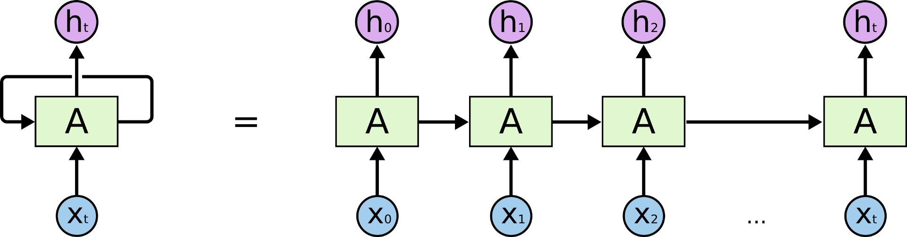

# Add two binary numbers using Recurent Neural Networks
Quick introduction to RNNs in Tensorflow 2.0.



## Avalible notebooks
* Add 2 binary numbers 
## Getting Started

To run it You need jupyter notebook installed or You can run it using [google colab](https://colab.research.google.com)
You need to run one of the noteooks.

### Prerequisites
```
-tensorflow 2.0
-numpy
-tqdm
```


## Authors

* [tugot17](https://github.com/tugot17)


## License

This project is licensed under the MIT License - see the [LICENSE](LICENSE) file for details


